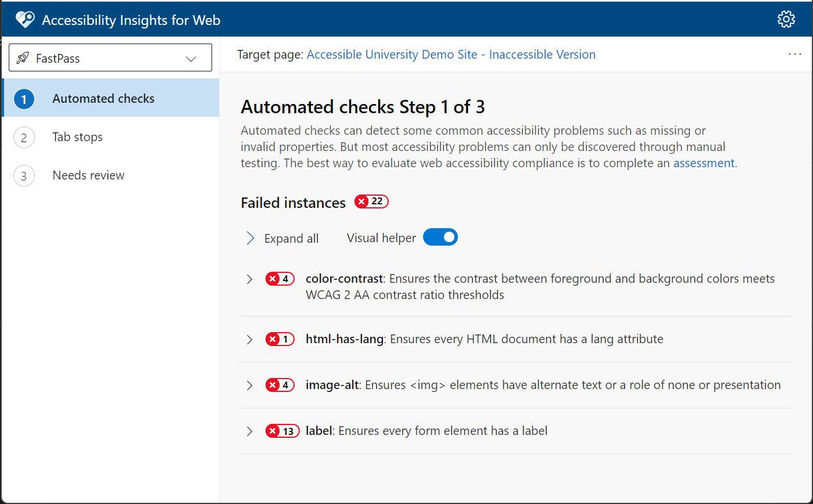
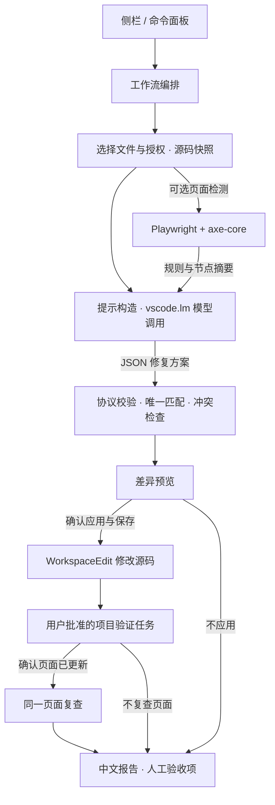

# Accessibility Agent

Accessibility - 网站的无障碍访问，目的是让残障人士也能使用不受妨碍

- Run automated Accessibility Insights Fast Pass
- Run manual Tab Stops test in Accessibility Insights
- Perform a Contrast Theme Test
- ... ...

### 环境要求

- VS Code **1.95+**
- 已登录且有调用额度的 GitHub Copilot，或通过 `vscode.lm` 开放模型的提供方
- 页面检测需要 Chrome、Edge 或 Chromium，以及可访问的本地或测试页面

### 操作步骤

1. **安装**：扩展面板 →「…」→「从 VSIX 安装」，选择插件包。
2. **检查**：打开项目，点击「开始检查与修复」，选择文件、检测方式和模型，确认授权。页面检测需提供 URL。
3. **修复**：审查差异，确认应用，再确认保存。
4. **验证**：运行已批准的项目测试；确认页面加载新代码后，可重新检测。
5. **交付**：查看中文报告和人工验收项。需回退时执行「无障碍：撤销最近一次修复」，再手动保存。

## 架构设计

插件运行于 VS Code Extension Host，无自建后端。AI 负责生成修复方案，插件负责范围授权、协议校验、编辑审批与验证执行。

### 模块职责

- **入口与编排**：[src/extension.ts](src/extension.ts)、[src/dashboard.ts](src/dashboard.ts)，管理命令、侧栏和执行流程。
- **文件与编辑**：[src/workspace.ts](src/workspace.ts)，管理文件授权、冲突检查、保存与撤销。
- **模型接入**：[src/model.ts](src/model.ts)、[src/core/prompt.ts](src/core/prompt.ts)，构造提示并处理模型响应。
- **页面检测**：[src/core/scanner.ts](src/core/scanner.ts)，执行隔离浏览器扫描并提取结果。
- **修复审批**：[src/core/plan.ts](src/core/plan.ts)、[src/preview.ts](src/preview.ts)，校验修复方案并展示差异。
- **验证与交付**：[src/validation.ts](src/validation.ts)、[src/core/report.ts](src/core/report.ts)，运行已有任务并生成报告。

### 数据与安全边界

- **模型输入**：仅发送授权源码及可选检测摘要，不发送完整 DOM、截图或 Cookie；不收集密钥，无遥测。源码仍须遵守组织的数据使用政策。
- **执行权限**：AI 不能直接执行命令；文件变更必须通过精确匹配和用户确认。任务只来自已有配置，执行前需审查命令及前置任务。
- **浏览器**：无登录 Cookie，默认仅允许目标来源的 GET/HEAD；阻止未授权跨源请求、WebSocket 和 Service Worker，不点击业务按钮。GET 仍可能产生副作用，仅检测获授权的可信站点。
- **存储**：预览和最近一次撤销快照仅存内存，重载后失效；文件有额外修改时拒绝覆盖。报告写入 `globalStorageUri/reports`，保留 20 份；重载后需从存储目录查看历史报告。

页面检测仅覆盖初始状态；读屏、键盘完整路径、图片含义、字幕与复杂交互仍需人工验收。自动检查通过不代表完整 WCAG 合规。完整说明见 [SECURITY.md](SECURITY.md)。

## 配置

在 VS Code 设置中搜索 `accessibilityAgent`。

- `modelId`：首选模型，默认在运行时选择。
- `maxFiles`：单次文件数，默认 8，范围 1–20。
- `browserPath`：浏览器绝对路径，默认自动发现。
- `allowedResourceOrigins`：额外允许的资源来源，默认无。
- `validationTimeoutSeconds`：任务超时秒数，默认 120，范围 10–900。

## 开发与交接

使用 Node.js 22 和 npm，在本仓库执行 `npm ci` 安装锁定依赖；按 F5 启动调试宿主。已有 Chrome/Edge 可直接用于检测，否则执行 `npm run browser:install` 安装 Chromium。

- `npm run verify`：类型检查、单元测试与构建。
- `npm run test:browser`：浏览器检测、修复与复查测试。
- `npm run test:extension`：插件宿主、模型分支与任务测试。
- `npm run package`：生成 VSIX，不发布。
- `npm run test:package`：验证包内依赖、浏览器与宿主。
- `npm run release:verify`：运行完整自动交付检查。

宿主测试默认使用 VS Code 1.95.3，可设置环境变量 `VSCODE_TEST_VERSION=stable` 验证当前稳定版；Linux 无桌面环境需要 Xvfb。构建内联 axe-core/Zod，Playwright 作为包内运行时保留，**不要给打包命令添加 `--no-dependencies`**。

交接入口：[CI 配置](.github/workflows/ci.yml) · [验证记录](docs/VERIFICATION.md) · [发布验收与回退](docs/RELEASE.md) · [Agent 工作规范](.github/agents/accessibility.agent.md)。模型自动测试使用替身；真实账号、辅助技术和生产审批按发布清单验收。插件不自动提交、推送或部署
